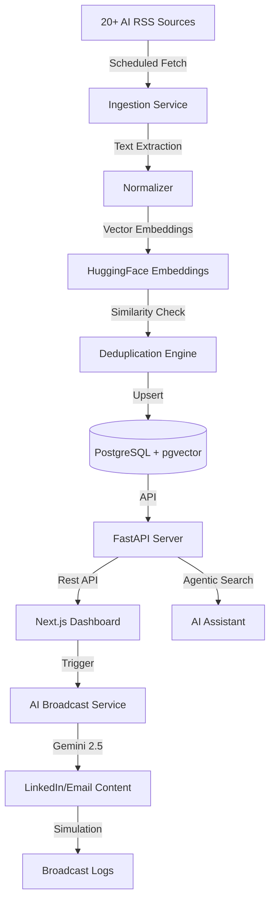

# AI News Aggregator & Broadcasting Dashboard

A production-ready MVP for aggregating, deduplicating, and broadcasting AI-related news from 20+ high-signal sources.

## 1. Architecture Diagram



## 2. Prerequisites

Before you begin, ensure you have the following installed:
- **Docker & Docker Compose** (Recommended)
- **Python 3.10+** (For local backend setup)
- **Node.js 18+ & npm** (For local frontend setup)
- **PostgreSQL** with **pgvector** extension (For local database setup)
- **Google Gemini API Key** (Required for AI features)

## 3. Environment Variables

The project uses two separate environment files to manage configuration:

### A. Root `.env` (Backend & Infrastructure)
Used by the FastAPI backend and Docker Compose. Create this in the project root.

| Variable | Description |
| :--- | :--- |
| `GEMINI_API_KEY` | Your Google Gemini API Key (Required for AI features). |
| `DATABASE_URL` | PostgreSQL Connection String (e.g., Supabase or local). |

### B. `frontend/.env.local` (Frontend)
Used by the Next.js frontend. Create this in the `frontend/` directory.

| Variable | Description | Default |
| :--- | :--- | :--- |
| `NEXT_PUBLIC_API_URL` | The URL of your running FastAPI backend. | `http://localhost:8000` |

## 4. Getting Started (Docker - Recommended)

The easiest way to run the entire stack is using Docker Compose.

1. Clone the repository.
2. Create your `.env` file as described above.
3. Start the services:
   ```bash
   docker-compose up --build
   ```
4. Access the applications:
   - **Frontend (Dashboard)**: [http://localhost:3000](http://localhost:3000)
   - **Backend (API Docs)**: [http://localhost:8000/docs](http://localhost:8000/docs)

## 5. Local Setup (Development)

If you prefer to run the services individually for development:

### A. Database
Ensure PostgreSQL is running and the `pgvector` extension is enabled. You can run the database via Docker while keeping the app local:
```bash
docker-compose up db -d
```

### B. Backend (FastAPI)
1. Navigate to the backend directory:
   ```bash
   cd backend
   ```
2. Create and activate a virtual environment:
   ```bash
   python -m venv venv
   source venv/bin/activate  # Windows: venv\Scripts\activate
   ```
3. Install dependencies:
   ```bash
   pip install -r requirements.txt
   ```
4. Run the server:
   ```bash
   uvicorn main:app --reload --port 8000
   ```

### C. Frontend (Next.js)
1. Navigate to the frontend directory:
   ```bash
   cd frontend
   ```
2. Install dependencies:
   ```bash
   npm install
   ```
3. Run the development server:
   ```bash
   npm run dev
   ```

## 6. Implementation Logic

### Deduplication Strategy
To ensure a high-signal feed, the system employs **Dual-Layer Deduplication**:
1. **Hash-based**: Prevents exact URL or title duplication at the database level.
2. **Vector-based**: Computes a cosine distance between the new item's embedding and existing items. Items with a similarity > 0.90 are flagged as duplicates.

### AI Integration
- **Summarization**: Uses Gemini to analyze complex research papers and blog posts.
- **AI Assistant**: A RAG-enabled chatbot that allows users to query ingested news.
- **Broadcast Service**: Automated conversion of news into LinkedIn posts and emails.

## 7. Troubleshooting

- **Database Connection Error**: Ensure `DATABASE_URL` is correct and the `db` service is healthy.
- **Gemini API Errors**: Check your `GEMINI_API_KEY` and ensure it has sufficient quota.
- **Frontend not reaching Backend**: Verify `NEXT_PUBLIC_API_URL` matches your backend's address in `frontend/.env.local` or Docker environment.

---

