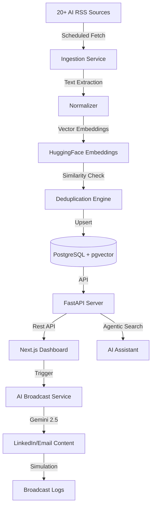

# AI News Aggregator & Broadcasting Dashboard

A production-ready MVP for aggregating, deduplicating, and broadcasting AI-related news from 20+ high-signal sources.

## 1. Architecture Diagram



## 2. Database Schema

The system uses **PostgreSQL** with the **pgvector** extension for semantic search and deduplication.

### Key Tables:
- **`sources`**: Metadata for the 20+ monitored AI blogs and feeds.
- **`news_items`**: Normalized news storage including `title`, `summary`, `url`, and a `vector(384)` embedding for deduplication.
- **`favorites`**: Links users to their saved news items.
- **`broadcast_logs`**: History of all generated social media/email posts.
- **`users`**: Minimal user management for session/favorite tracking.

## 3. Implementation Logic & Decisions

### Deduplication Strategy
To ensure a high-signal feed, the system employs **Dual-Layer Deduplication**:
1. **Hash-based**: Prevents exact URL or title duplication at the database level.
2. **Vector-based**: Computes a cosine distance between the new item's embedding and existing items. Items with a similarity > 0.90 are flagged as duplicates but kept in the DB for reference.

### AI Integration
- **Summarization & Sentiment**: Uses Gemini to analyze complex research papers and blog posts.
- **AI Assistant**: A RAG-enabled chatbot that allows users to query the ingested news using natural language.
- **Social Media Generation**: Automated conversion of technical news into high-engagement LinkedIn posts, emails, and WhatsApp summaries.

## 4. Backend API Endpoints

| Category | Endpoint | Description |
| :--- | :--- | :--- |
| **News** | `GET /news/` | Fetch latest feed (filtered/searchable) |
| **Ingestion**| `POST /news/refresh` | Manually trigger a crawl of all sources |
| **Favorites**| `POST /favorites/` | Save an item to the dashboard |
| **Broadcast**| `POST /broadcast/` | Generate AI post and simulate send |
| **Agent** | `GET /agent/ask` | Query the RAG-based AI assistant |

## 5. Deployment Setup (Docker)

### Prerequisites
- Docker & Docker Compose
- Google Gemini API Key

### Quickstart
1. Clone the repository.
2. Create a `.env` file in the root:
   ```env
   GEMINI_API_KEY=your_key_here
   ```
3. Run the deployment command:
   ```bash
   docker-compose up --build
   ```

The dashboard will be available at **`http://localhost:3000`**.

## 6. Project structure
- `/backend`: FastAPI service, ingestion worker, and AI agents.
- `/frontend`: Next.js dashboard with responsive Tailwind CSS design.
- `docker-compose.yml`: Multi-container orchestration (Web, UI, DB).

---


